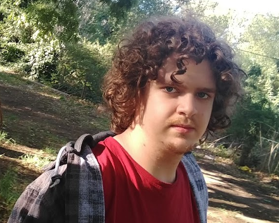

## Sebastian 

)

Hi. I am Sebastian and I am a Unity Programmer.

[Linked-in]()
[email]()
[Github]()

#### Aptitudes

* I am a fast and passionate learner.

* I *enjoy* programming and creative problem solving

#### Goals

Looking to develop my profesional carreer as a Game Developer.

#### Formation
[Escuela de Arte Multimedial Da Vinci]() | Virtual Simulation Designer (Game Development)  
March 2019 - Present(December 2022 Expected)  
***Thesis project is already finished***

[CUI - Centro Universitario de Idiomas](https://cui.edu.ar) | English
Currently Studing Formal English.  
March 2022 (Level 14) - Present (Level 15)  
C1 [CEFR](https://en.wikipedia.org/wiki/Common_European_Framework_of_Reference_for_Languages) (Advanced)
***Started at Level 14 due to previous experience with the English Language***

[Colegio Nuevo Pensar]() | Secondary School (High School)
2013 - 2018, Ciudad Autonoma de Buenos Aires.
* Bachiller en Artes

<!-- #### Experience -->

#### Skills
##### Languages
* Native Spanish
* English in Full Capacity
  
##### Languages
Mainly [C#](https://docs.microsoft.com/en-us/dotnet/csharp/) and some [Lua](https://www.lua.org).
Also a little [C/C++](https://en.wikipedia.org/wiki/C%2B%2B) and [Odin](https://odin-lang.org).
And automation with [Python](https://www.python.org) and [Bash]().
##### Tools and Software
Unity:
* Baked and Realtime Lighting.
* Rendering Optimization.
* General Programming.

It's Official tools:
* URP, ShaderGraph and CustomRender Passes.
* Unity's new InputSystem Package.
* UnityEditor API (Editor Tooling with ImGUI)

As well as Third Party tools:
* [MoonSharp Interpreter](https://www.moonsharp.org)

Software I have the most experience with:
* Photoshop/GIMP, Audacity and Blender.
* Git, Github, their GUIs and SourceControl in General.

    Projects

---

